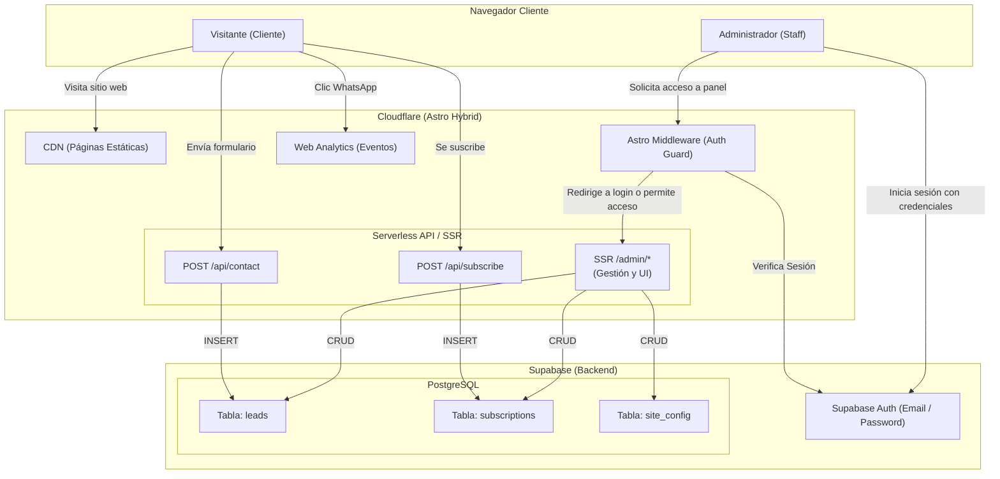
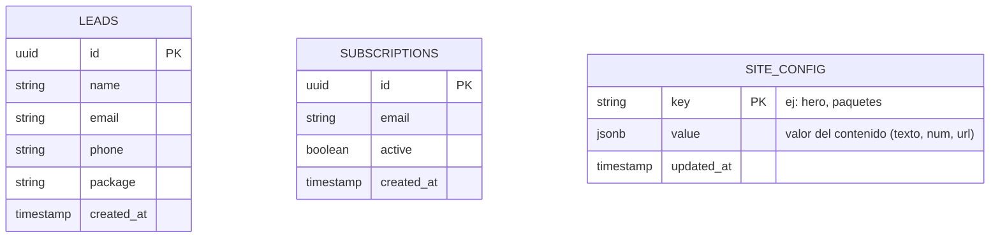

# Flores en Paz 🕊️ – Presencia Web

Repositorio oficial del sitio web y panel de administración para "Flores en Paz", un servicio de arreglos florales fúnebres en Lima, Perú. Construido con tecnología moderna enfocada en altísima velocidad, SEO y facilidad de gestión para el negocio.

---

## 🏗️ Arquitectura del Sistema

El proyecto utiliza una arquitectura **JAMstack Híbrida** con renderizado estático y serverless.

- **Framework**: [Astro 4](https://astro.build) (Modo Hybrid)
- **Adaptador Edge**: `@astrojs/cloudflare`
- **Estilos & Tipografías**: [Tailwind CSS 3](https://tailwindcss.com) + Google Fonts (*Italiana* para títulos y *Raleway* para cuerpo)
- **Base de Datos & Auth**: [Supabase](https://supabase.com) (PostgreSQL + Supabase Auth)
- **API Runtime**: Cloudflare Workers (Astro API Routes Serverless & Middleware)
- **Panel de Administración**: Nativo (Desarrollado en Astro SSR, servido en `/admin`)

### Diagrama de Arquitectura (C4)



### Modelo de Datos (ERD)



---

## 🛠️ Instalación y Desarrollo Local

### 1. Clonar e instalar dependencias:
```bash
git clone https://github.com/pcamacho447/presencia-website.git
cd presencia-web
npm install
```

### 2. Configurar variables de entorno locales:
Copia `.env.example` a `.env.local` e ingresa las credenciales de tu proyecto Supabase:
```bash
cp .env.example .env.local
```

### 3. Iniciar el servidor de desarrollo:
```bash
npm run dev
```
Accede en tu navegador a [http://localhost:4321/](http://localhost:4321/).

### 4. Compilar para producción (Build Verification):
```bash
npm run build
```

---

## 🔐 Variables de Entorno

Configura las siguientes variables locales en `.env.local` y en producción dentro del panel de **Cloudflare Pages** (`Settings > Environment Variables`):

| Variable | Descripción | Ubicación |
|---|---|---|
| `SUPABASE_URL` | URL de tu proyecto Supabase (`https://xxx.supabase.co`) | `.env.local` & Cloudflare Pages Env |
| `SUPABASE_ANON_KEY` | Key pública (anon) de Supabase para el cliente Auth | `.env.local` & Cloudflare Pages Env |
| `SUPABASE_SERVICE_ROLE_KEY` | Key privada de servicio (`service_role`) para endpoints backend | `.env.local` & Cloudflare Pages Env (Secret) |

> ⚠️ **Importante**: La `SUPABASE_SERVICE_ROLE_KEY` **nunca** debe exponerse. Solo se utiliza dentro de los endpoints serverless de `/api/`.

---

## 🗄️ Base de Datos (Supabase)

Para inicializar las tablas en un nuevo proyecto de Supabase, ejecuta este SQL en el **SQL Editor**:

```sql
-- 1. Crear tabla de Leads (Contactos)
CREATE TABLE leads (
  id UUID DEFAULT gen_random_uuid() PRIMARY KEY,
  name TEXT NOT NULL,
  email TEXT NOT NULL,
  phone TEXT NOT NULL,
  package TEXT NOT NULL,
  created_at TIMESTAMP WITH TIME ZONE DEFAULT NOW()
);

-- 2. Crear tabla de Configuración del Sitio
CREATE TABLE site_config (
  key TEXT PRIMARY KEY,
  value JSONB NOT NULL,
  updated_at TIMESTAMP WITH TIME ZONE DEFAULT NOW()
);

-- 3. Crear tabla de Suscripciones
CREATE TABLE subscriptions (
  id UUID DEFAULT gen_random_uuid() PRIMARY KEY,
  email TEXT UNIQUE NOT NULL,
  active BOOLEAN DEFAULT TRUE,
  created_at TIMESTAMP WITH TIME ZONE DEFAULT NOW()
);

-- 4. Insertar los datos base (Hero y Paquetes)
INSERT INTO site_config (key, value) VALUES
('hero', '{"video_url": "/videos/hero.mp4", "title_es": "Flores en Paz", "title_en": "Peaceful Flowers", "subtitle_es": "Honrando su memoria", "subtitle_en": "Honoring their memory"}'),
('paquetes', '[{"id": "esencial", "precio_sol": "500", "precio_usd": "150", "destacado": false}, {"id": "serenidad", "precio_sol": "800", "precio_usd": "250", "destacado": true}, {"id": "memoria_viva", "precio_sol": "1200", "precio_usd": "400", "destacado": false}]');
```

---

## 👑 Panel de Administración (`/admin`)

El sitio incluye un panel de control nativo, protegido por Astro Middleware y Supabase Auth, que permite gestionar dinámicamente el contenido sin depender de un CMS de terceros.

### Acceso
- URL: `https://tusitio.com/admin/` (o `http://localhost:4321/admin/` en local).
- Las rutas administrativas están protegidas y exigen **Email y Contraseña**.
- Las credenciales deben registrarse primero en el panel de Supabase (`Authentication > Users`).

### Módulos del Panel
- **Dashboard**: Vista general y métricas.
- **Gestión de Leads (`/admin/leads`)**: Tabla en tiempo real con solicitudes de contacto.
- **Gestión de Paquetes (`/admin/paquetes`)**: Editar precios y destacar paquetes en vivo.
- **Gestión del Hero (`/admin/sitio`)**: Cambiar textos bilingües y el video de fondo.

---

## 🚀 Despliegue a Producción (Cloudflare Pages)

1. Conecta tu repositorio de GitHub a **Cloudflare Pages**.
2. Configura los parámetros de build:
   - **Framework preset**: `Astro`
   - **Build command**: `npm run build`
   - **Build output directory**: `dist`
3. Agrega las variables de entorno listadas arriba en la sección `Settings > Environment Variables`.
4. ¡Despliega! Cloudflare compilará automáticamente el sitio estático y desplegará el Astro Middleware en el borde (Workers).

---

© 2026 Flores en Paz — Todos los derechos reservados.
