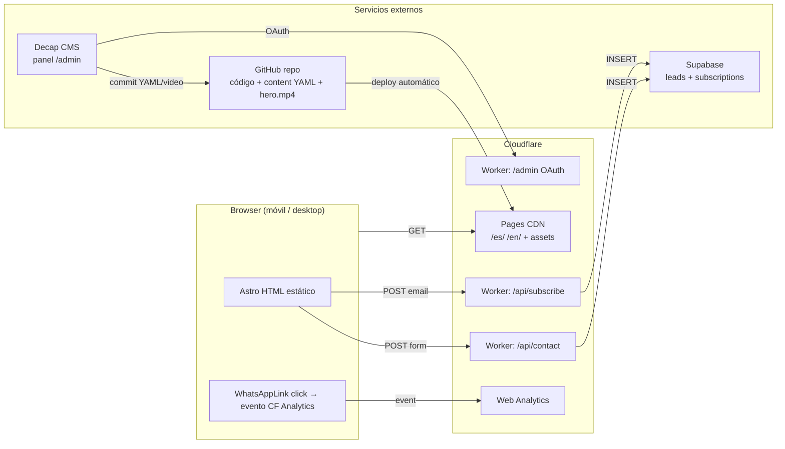

# Architecture Spine — presencia-web

## Paradigm

**Content-first static site with server-side edge functions.**
Astro genera HTML puro en build time. Todo lo que puede ser estático, lo es. Las únicas funciones server-side son los endpoints de formulario y la autenticación de Decap CMS, ejecutadas como Cloudflare Workers al borde de la red — no en un servidor central.

---

## Inherited Invariants

Ninguno — spine raíz, sin padre.

---

## Architecture Decisions

### AD-1 — Framework: Astro + adapter Cloudflare
**Binds:** Todo componente UI es un Astro Component (`.astro`). Los Astro Islands (interactividad puntual) se limitan al acordeón FAQ y el evento WhatsApp click tracker.
**Prevents:** Usar React/Vue/Svelte como framework principal. Shipping de JavaScript innecesario al browser.
**Rule:** `output: 'hybrid'` en `astro.config.mjs` — páginas estáticas por defecto, rutas API como Workers.

### AD-2 — Hosting: Cloudflare Pages + Workers
**Binds:** Deploy automático desde rama `main` en GitHub. Preview deployments en PRs automáticamente. Variables de entorno (Supabase keys) solo en el panel de Cloudflare — nunca en el repo.
**Prevents:** Hosting en Vercel, Netlify, o servidor VPS propio.
**Rule:** Un solo proyecto en Cloudflare Pages cubre el sitio estático y los Workers via Astro API routes.

### AD-3 — CMS: Decap CMS
**Binds:** Todo contenido editable (precio Esencial, precio Serenidad, precio Memoria Viva, URL video hero, textos de paquetes) vive en archivos YAML bajo `src/content/`. Decap CMS los edita vía panel `/admin`.
**Prevents:** Edición directa de archivos `.astro` por el usuario del negocio.
**Rule:** El freelancer implementa un Cloudflare Worker dedicado para el OAuth callback de GitHub (auth de Decap). Sin este Worker, el panel `/admin` no funciona en Cloudflare Pages.

### AD-4 — Base de datos: Supabase (proyecto nuevo)
**Binds:** Proyecto Supabase exclusivo para presencia-web (separado de otros proyectos). Tablas iniciales: `leads` y `subscriptions`. RLS activo en ambas tablas. El service role key de Supabase vive solo en variables de entorno de Cloudflare.
**Prevents:** Usar el proyecto Supabase de otro producto. Exponer keys de Supabase al browser/cliente.
**Rule:** El único canal de escritura a Supabase es el Cloudflare Worker del formulario — nunca el cliente JavaScript.

### AD-5 — Flujo de leads
**Binds:** `POST /api/contact` → Worker → Supabase `leads`. `POST /api/subscribe` → Worker → Supabase `subscriptions`. Los leads se consultan directamente desde el dashboard de Supabase.
**Prevents:** Notificaciones de email o WhatsApp en v1. UI de admin custom para leads.
**Rule:** Sin dependencias de servicios de email (Resend, SendGrid) en v1.

### AD-6 — Internacionalización
**Binds:** Astro i18n nativo. Rutas `/es/` (default) y `/en/`. Todo texto visible del sitio se define en archivos de traducción `src/i18n/es.json` y `src/i18n/en.json`. Tags `hreflang` generados automáticamente.
**Prevents:** Toggle de idioma via JavaScript sin rutas reales. Texto hardcodeado en componentes `.astro`.
**Rule:** El raíz `/` redirige a `/es/`. Todo componente accede a textos via helper `t('key')`.

### AD-7 — Analytics y conversión
**Binds:** Cloudflare Web Analytics (sin cookies, GDPR-compliant) activado en el panel de Cloudflare. Evento JavaScript `whatsapp_click` disparado en cada click a cualquier enlace WhatsApp del sitio.
**Prevents:** Google Analytics, Meta Pixel, o cualquier tracker con cookies en v1.
**Rule:** Todos los enlaces WhatsApp usan un componente `<WhatsAppLink>` centralizado que dispara el evento — no se implementa el tracker inline en cada sección.

### AD-8 — Video Hero
**Binds:** Archivo de video en `/public/videos/hero.mp4`. Referenciado por ruta relativa fija. Cloudflare Pages lo sirve via CDN global. Para swap: nuevo archivo subido via Decap CMS media library → commit automático → redeploy (~60 segundos).
**Prevents:** Dependencia de YouTube, Vimeo, o Cloudflare R2/Stream.
**Rule:** El video nunca supera 50MB para mantener tiempos de build y deploy aceptables.

### AD-9 — Tipografía
**Binds:** `Italiana` para todos los headings (`h1`–`h4`). `Raleway` para body, párrafos, labels y CTAs. Ambas fuentes cargadas desde Google Fonts con `font-display: swap`.
**Prevents:** Usar otras fuentes sin aprobación explícita.

### AD-10 — Panel Admin Nativo en Astro + Supabase (reemplaza Decap CMS)
**Binds:** Reemplazar la dependencia de Decap CMS y GitHub OAuth por un Panel de Administración 100% nativo dentro del proyecto en `/admin`, renderizado dinámicamente con Astro SSR (`export const prerender = false`) y respaldado por Supabase + Cloudflare Workers.
- Sub-rutas: `/admin/leads` (gestión de solicitudes), `/admin/paquetes` (edición de paquetes y precios S/ y USD), `/admin/sitio` (textos bilingües y URL del video hero).
**Prevents:** Dependencias de autenticación externa de GitHub OAuth, fallos de conexión en cliente y librerías externas de CMS de terceros.
**Rule:** Endpoints `/api/admin/*` usan `SUPABASE_SERVICE_ROLE_KEY` del lado del servidor. Protección de acceso administrada nativamente o vía Cloudflare Access (Zero Trust).


---

## Deferred

| Tema | Condición para revisitar |
|---|---|
| Notificaciones de leads (email/WhatsApp) | Cuando el volumen de leads supere la capacidad de revisión manual en Supabase |
| Cloudflare R2 para assets de media | Si el repo supera 200MB por videos acumulados |
| Checkout online / pagos | Cuando se decida integrar pago sin pasar por WhatsApp |
| Testimonios, Fechas Especiales, Portafolio | Iteración v2 con contenido real acumulado |
| Staging environment separado | Si hay un equipo de más de una persona haciendo cambios |

---

## Seed (estado inicial del código — dueño: el código una vez creado)

```
presencia-web/
├── src/
│   ├── components/        # Astro components (Header, Hero, Paquetes, FAQ…)
│   │   └── WhatsAppLink.astro  # Componente centralizado con tracker
│   ├── content/           # YAML gestionado por Decap CMS
│   │   ├── config.ts
│   │   ├── paquetes.yaml
│   │   └── site.yaml      # video URL, textos hero
│   ├── i18n/
│   │   ├── es.json
│   │   └── en.json
│   ├── pages/
│   │   ├── es/index.astro
│   │   ├── en/index.astro
│   │   └── api/
│   │       ├── contact.ts     # Worker: guarda lead en Supabase
│   │       └── subscribe.ts   # Worker: guarda email en Supabase
│   └── layouts/
│       └── Base.astro
├── public/
│   ├── admin/             # Decap CMS config.yml
│   └── videos/
│       └── hero.mp4
└── astro.config.mjs       # output: 'hybrid', adapter: cloudflare, i18n config
```

---

## Diagrama


