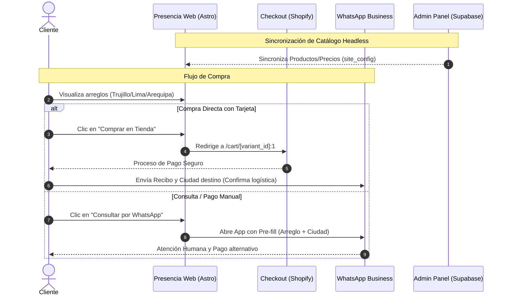

# Architecture Spine — presencia-web

## Paradigm

**Content-first static site with server-side edge functions.**
Astro genera HTML puro en build time. Todo lo que puede ser estático, lo es. Las únicas funciones server-side son los endpoints de formulario, la sincronización con Shopify, y la autenticación del panel de administración nativo, ejecutadas como Cloudflare Workers al borde de la red.

---

## Inherited Invariants

Ninguno — spine raíz, sin padre.

---

## Architecture Decisions

### AD-1 — Framework: Astro + adapter Cloudflare
**Binds:** Todo componente UI es un Astro Component (`.astro`). Los Astro Islands se limitan al acordeón FAQ y trackeo de eventos.
**Prevents:** Usar React/Vue/Svelte como framework principal. Shipping de JavaScript innecesario.
**Rule:** `output: 'hybrid'` en `astro.config.mjs` — páginas estáticas por defecto, rutas API como Workers.

### AD-2 — Hosting: Cloudflare Pages + Workers
**Binds:** Deploy automático desde rama `main` en GitHub. Variables de entorno en el panel de Cloudflare.
**Rule:** Un solo proyecto en Cloudflare Pages cubre el sitio estático y los Workers via Astro API routes.

### AD-3 — CMS: Reemplazado por Panel Admin Nativo
*(Derogado a favor de AD-10)*

### AD-4 — Base de datos: Supabase (proyecto nuevo)
**Binds:** Proyecto Supabase exclusivo. Tablas: `leads`, `subscriptions`, y configuración dinámica en `site_config`.
**Rule:** El único canal de escritura a Supabase son los Cloudflare Workers.

### AD-5 — Flujo de leads
**Binds:** `POST /api/contact` → Worker → Supabase `leads`.

### AD-6 — Internacionalización
**Binds:** Astro i18n nativo. Rutas `/es/` y `/en/`.

### AD-7 — Analytics y conversión
**Binds:** Cloudflare Web Analytics y trackeo del evento `whatsapp_click`.

### AD-8 — Video Hero
**Binds:** Archivo de video en `/public/videos/hero.mp4` o provisto vía Supabase `site_config`.

### AD-9 — Tipografía
**Binds:** `Italiana` (headings), `Raleway` (body).

### AD-10 — Panel Admin Nativo en Astro + Supabase
**Binds:** Panel de Administración 100% nativo dentro del proyecto en `/admin`.
**Rule:** Rutas protegidas que modifican configuraciones usan `SUPABASE_SERVICE_ROLE_KEY`.

### AD-11 — Autenticación del Panel Admin: Supabase Auth + Magic Link
**Binds:** Acceso protegido por Supabase Auth (correo sin contraseña / Magic Link). Middleware bloquea accesos no autorizados a `/admin/*` y `/api/admin/*`.

### AD-12 — Security Headers HTTP
**Binds:** Cabeceras inyectadas vía `public/_headers`.

### AD-13 — Catálogo Dinámico de Arreglos Florales
**Binds:** Datos guardados en `site_config` bajo la clave `'catalogo'`.

### AD-14 — Arquitectura Unificada y Preparación E-commerce
**Binds:** `<Packages.astro>` y `<Catalog.astro>` leen dinámicamente de Supabase con fallback local. Se define estructura para e-commerce headless.

### AD-15 — Integración Shopify Headless y Flujo Post-Venta WhatsApp
**Binds:** 
- El inventario real proviene de Shopify (Presencia-Web Store).
- Un script de sincronización (`/api/admin/shopify-sync`) y local scripts consumen el CSV o la Storefront/Admin API para mantener los productos sincronizados en `site_config` de Supabase.
- Al hacer click en "Comprar" desde el sitio, los usuarios son enviados directamente al checkout de Shopify usando la URL `https://[shopify-domain]/cart/[variant_id]:1`.
- **Post-venta vital:** Tras finalizar el pago en Shopify, la confirmación definitiva e información del lugar de envío (cementoerio/iglesia) se centraliza **obligatoriamente por WhatsApp**.
- **Cobertura geográfica:** Se solicita explícitamente la ciudad destino: Trujillo, Lima, o Arequipa en el pre-fill de WhatsApp ("📍 Trujillo · Lima · Arequipa").
**Prevents:** Depender de una tienda Shopify con frontend Liquid. La web se mantiene en Astro por performance extrema (Hybrid render), usando Shopify solo como checkout/headless CMS.
**Rule:** Ambos CTAs (Comprar vía Shopify y Consultar vía WhatsApp) mantienen igualdad de jerarquía visual en componentes como `<Catalog.astro>`, ya que la conversión final a nivel operativo ocurre conectando la orden con WhatsApp para la logística en las 3 ciudades.

---

## Diagrama del Flujo Completo (Mermaid)

---

## Deferred

| Tema | Condición para revisitar |
|---|---|
| Notificaciones de leads (email/WhatsApp) automáticas | Cuando el volumen de leads supere la capacidad de revisión manual |
| Cloudflare R2 para assets de media | Si el repo supera 200MB por videos |
| Automatización de Webhooks Shopify -> WhatsApp | Iteración futura para enviar mensajes automáticamente tras pago en Shopify |

