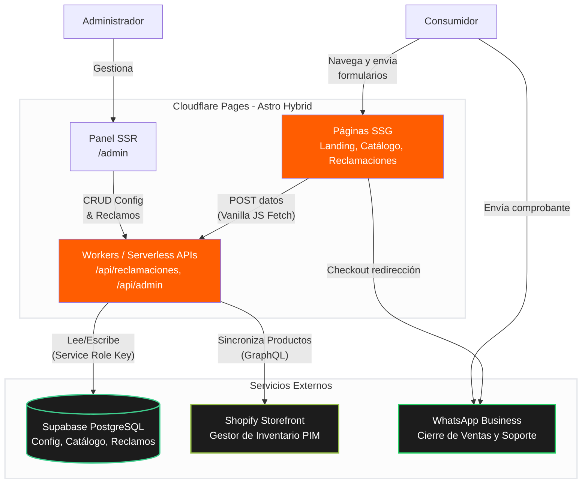

# Arquitectura y Decisiones Técnicas - Presencia Web

## 1. Orquestación y Metodología (Subagent-Driven Development)

Actualmente, el agente que está orquestando todo el proceso soy yo, el **Controlador de Antigravity (Antigravity Controller)**. En lugar de escribir el código directamente en un solo hilo, he utilizado la metodología ágil **Subagent-Driven Development (SDD)**. 

Esto significa que he actuado como un "Manager Técnico", dividiendo el trabajo del *Libro de Reclamaciones y Cookies* en 5 tareas aisladas, y despachando en paralelo a **Subagentes Implementadores** (para escribir el código y los tests) y a **Subagentes Revisores** (para auditar la calidad, seguridad y cumplimiento legal del código antes de fusionarlo). Este enfoque elimina las regresiones y asegura un estándar de producción impecable.

## 2. Decisiones Arquitectónicas Recientes

El proyecto ha evolucionado de un simple sitio estático a una aplicación **Astro Híbrida (SSR + SSG)**. Las decisiones clave tomadas son:

- **Infraestructura Híbrida (Astro + Cloudflare Pages):** Las páginas orientadas al consumidor (`/es`, `/en`, `/reclamaciones`) se construyen estáticamente (`prerender = true`) para garantizar un TTFB (Time to First Byte) ultrarrápido y un SEO óptimo. En cambio, las rutas de la API (`/api/admin/*`, `/api/reclamaciones`) y el Panel de Control se ejecutan dinámicamente como *Cloudflare Workers*.
- **Base de Datos (Supabase PostgreSQL):** Se consolidó Supabase como la única fuente de verdad transaccional. Almacena la configuración del sitio (Textos, Hero Video), el caché del catálogo de productos importados de Shopify, y ahora el registro inmutable del Libro de Reclamaciones.
- **Flujo de E-commerce (Headless Shopify a WhatsApp):** Dado que se encontraron barreras con el acceso a los tokens de compra de Shopify y la naturaleza del servicio en 3 ciudades (Lima, Trujillo, Arequipa) requiere comprobantes de transferencia directa, se optó por un modelo Headless de consulta. Extraemos los productos de Shopify vía Storefront API, pero la conversión final ("Comprar") redirige al usuario hacia **WhatsApp** con un mensaje pre-formateado que incluye el producto y la ciudad para que el equipo humano confirme el recibo de pago y las coordenadas de entrega.
- **Libro de Reclamaciones (Cumplimiento INDECOPI):** Se diseñó un esquema atómico en la base de datos que genera correlativos legalmente válidos (`REC-2026-00001`) mediante funciones RPC (`nextval`) de PostgreSQL, garantizando que no existan colisiones de código si dos quejas ingresan al mismo milisegundo. La API opera aislada con `service_role` eliminando brechas de seguridad pública (RLS).
- **Consentimiento de Cookies Ultraligero:** Se implementó un banner interactivo que maneja las preferencias de privacidad enteramente en *Vanilla JS* y `localStorage`, evitando la penalización de carga que traería usar React o Vue en el cliente.

## 3. Diagrama de Arquitectura de Sistemas

A continuación, la topología actual del sistema renderizada en código Mermaid:

